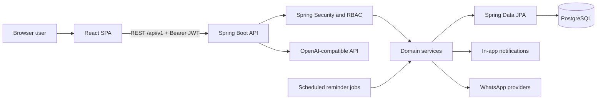
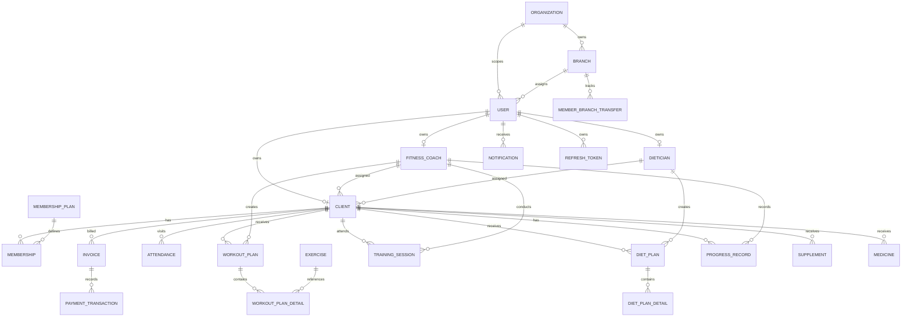

# Gym Management System: Architecture and Product Guide

## 1. Purpose

This repository implements a role-based gym management web application for administrators, fitness
coaches, dieticians, and clients. It brings member registration, staff assignment, memberships,
workout planning, diet planning, training sessions, progress tracking, notifications, and profile
management into one system.

The system includes Phase 2 billing, invoice, attendance, business reporting, and automated
notification capabilities. Production deployment still requires managed secrets, versioned baseline
migrations for the original schema, observability, and infrastructure controls described below.

## 2. Current Technology Stack

| Area | Implementation |
|---|---|
| Backend | Java 21, Spring Boot 3.3.4, Spring MVC, Spring Security, Spring Data JPA |
| Authentication | JWT access tokens, persisted refresh tokens, BCrypt passwords, role checks |
| Persistence | PostgreSQL, Hibernate, JPA auditing |
| API support | Bean Validation, MapStruct, Lombok, OpenAPI/Swagger, standardized responses |
| Background work | Spring scheduling for reminders |
| Integrations | Twilio WhatsApp, Meta WhatsApp Cloud API, OpenAI-compatible chat API |
| Frontend | React 18, TypeScript 6, Vite 5, Material UI 6 |
| Client state/data | Redux Toolkit, TanStack Query, Axios |
| Forms/routing | Formik, Yup, React Router 7 |
| Tests | JUnit, Mockito, Spring Data JPA integration tests, and TypeScript production builds |

## 3. High-Level Architecture



The backend follows a conventional layered design:

1. Controllers expose `/api/v1` REST endpoints and apply role checks.
2. DTOs validate and carry API input/output.
3. Services implement business rules and transactions.
4. MapStruct mappers convert entities and DTOs.
5. JPA repositories persist entities in PostgreSQL.
6. Cross-cutting components provide JWT security, auditing, error handling, logging, scheduling,
   API documentation, and external integrations.

The frontend is a single-page application. React Router selects a portal by role, Redux stores the
active login identity, TanStack Query owns server state, and Axios adds access tokens and performs a
single refresh-and-retry after a `401` response.

## 4. Roles and Capabilities

| Role | Implemented capabilities |
|---|---|
| `SUPER_ADMIN` | Manage organizations and branches; view organization/branch dashboards and reports; transfer members and staff |
| `ORGANIZATION_ADMIN` | Manage and report across branches in the assigned organization; configure branches and perform transfers |
| `BRANCH_MANAGER` | Operate and configure the assigned branch; manage branch-scoped staff and members; perform transfers |
| `RECEPTIONIST` | Access assigned-branch operational views and transfer workflows permitted by the current API |
| `COACH` | View assigned branch clients and use coach workflows |
| `DIETICIAN` | View assigned clients; manage diet plans, supplements, and medicines |
| `CLIENT` | View own dashboard, invoices, workout, diet, supplements, medicines, sessions, and progress; update profile and image |
| `ADMIN`, `FITNESS_COACH` | Backward-compatible legacy roles for the original single-branch administration and coaching screens |

Every non-authentication route requires a valid JWT at the security-filter level. Controller methods
add role restrictions for privileged actions. The frontend also protects routes, but backend checks
remain the real security boundary.

## 5. Functional Modules

### 5.1 Authentication and Security

- Login with email/password.
- Short-lived JWT access token (15 minutes by default).
- Server-persisted refresh token (7 days by default).
- Refresh, logout/revocation, and password change endpoints.
- BCrypt password hashing.
- Stateless Spring Security filter chain and role-based method authorization.
- CORS configuration and consistent JSON responses for unauthorized/forbidden requests.

Important current behavior: frontend credentials are held only in module memory. A browser refresh
therefore signs the user out even though the server refresh token may still be valid. This avoids
persistent browser token storage but needs an intentional production session strategy.

### 5.2 User and Profile Management

- Shared `User` identity with name, email, mobile number, password, role, active flag, and image.
- Separate profile entities for client, fitness coach, and dietician domain data.
- Self-service profile update for non-admin roles.
- JPG, PNG, or WebP profile image upload, limited to 5 MB by the endpoint.
- JPA auditing fields inherited from `BaseEntity`.

### 5.3 Client Lifecycle and Lead Handling

- Register a full client or save an inquiry.
- Convert an inquiry into a registered client.
- Search and paginate clients.
- Activate/deactivate clients.
- Store demographics, body measurements, fitness goals, address, and selected medical information.
- Assign or change a fitness coach and dietician.

### 5.4 Staff Management

- Admin CRUD and active-state management for coaches and dieticians.
- Role-specific professional profiles.
- Assigned-client lists for each coach and dietician.
- Self-service profile editing.

### 5.5 Memberships

- Create, list, update, and delete membership plan definitions.
- Assign a plan to a client.
- Renew a client's membership.
- Track start date, end date, and membership status.

Memberships model entitlement and validity. The separate billing module provides invoices, partial
and full payments, waivers, refunds, audit history, PDF generation, and optional email delivery.
Online payment-gateway capture, taxes, discounts, and reconciliation are not yet implemented.

### 5.6 Workout Management

- Exercise catalog grouped by exercise category.
- Coach-created workout plans for assigned clients.
- Plan details connect exercises with prescribed sets/repetitions and related instructions.
- Retrieve all client plans or today's workout.
- In-app and WhatsApp notification when a plan is assigned.

### 5.7 Training Sessions

- Coaches schedule sessions for clients.
- Session records link a client and coach and carry lifecycle status.
- Coaches can list their sessions and update status.
- Clients can retrieve all or upcoming sessions.

### 5.8 Diet, Supplements, and Medicines

- Dieticians create per-client diet plans with meal entries.
- Meal entries support meal type, food/quantity details, and optional time.
- Default reminder times exist for entries without a supplied meal time.
- Dieticians can record client supplements and medicines.
- Clients can view all assigned nutritional information.
- In-app and WhatsApp notification when a diet plan is assigned.

These records are wellness guidance, not an electronic prescribing system. Production use should
add explicit clinical disclaimers, consent, access auditing, and jurisdiction-specific controls.

### 5.9 Progress Tracking

- Coaches add and update dated client progress records.
- Records support body measurements and automatically calculated BMI.
- Clients and authorized staff can view progress history.
- The frontend presents progress in the client portal.

### 5.10 Notifications and Reminders

- In-app notification list, unread count, and mark-as-read action.
- Notification types cover workout assignment, diet update, session scheduling, and membership expiry.
- Scheduled WhatsApp meal reminders.
- Daily reminders to coaches/dieticians when assigned clients lack plans.
- Provider adapters for local log output, Twilio, and Meta WhatsApp Cloud API.

### 5.11 Ask AI

- Authenticated users can send a question through the floating UI widget.
- The backend calls an OpenAI-compatible chat-completions endpoint.
- Model, URL, prompt, temperature, token limit, and enabled state are configurable.
- The current assistant is general guidance; it is not grounded in the member's records and should not
  be treated as medical advice.
- [Advance_AI_Coach_2_2.txt](Advance_AI_Coach_2_2.txt) is a future specification, not a description
   of currently available RAG, scoring, goal prediction, or plan-generation behavior.

### 5.12 Dashboards

- The Phase 2 admin dashboard returns revenue, membership, attendance, and staff aggregates.
- Branch and organization dashboards return tenant-scoped server-side KPI aggregates.
- Coach dashboard summarizes assigned clients, plans, and sessions.
- Dietician dashboard summarizes assigned clients and diet plans.
- Client dashboard composes profile, workout, diet, supplement, medicine, session, and progress APIs.

Some legacy screens still compose multiple API requests in the browser. Attendance and multi-branch
reporting exist, but broader retention, cohort, adherence, and predictive analytics remain roadmap
items.

## 6. Core Data Model



The design keeps authentication data in `users` and role-specific data in profile tables. Client is
the central business entity; most operational records point to a client and to the staff member who
created or owns the record.

## 7. Main End-to-End Flows

### 7.1 Login and Authorized Request

1. User submits email and password to `POST /api/v1/auth/login`.
2. Spring AuthenticationManager verifies the active user and BCrypt password.
3. Backend returns identity details, access JWT, and refresh token.
4. Redux stores identity while the Axios module holds tokens in memory.
5. Axios sends `Authorization: Bearer <token>` on API requests.
6. On an eligible `401`, Axios exchanges the refresh token and retries once.
7. Logout revokes the refresh token and clears frontend state.

### 7.2 Onboard a Client

1. Admin creates an inquiry or registered client.
2. Backend creates the linked `User` with `CLIENT` role and the client profile.
3. Admin can convert an inquiry and assign a coach and dietician.
4. Admin assigns a membership plan with validity dates.
5. The client signs in and sees role-specific dashboard data.

### 7.3 Deliver a Workout Program

1. Coach opens the assigned-client list.
2. Coach maintains exercises and creates a workout plan with exercise details.
3. Backend verifies domain data, persists the parent and details, and creates notifications.
4. WhatsApp adapter attempts an assignment message when configured.
5. Client views the plan or today's workout in the client portal.
6. Coach records progress and schedules/finalizes sessions over time.

### 7.4 Deliver a Nutrition Program

1. Dietician selects an assigned client and creates a diet plan with timed meal entries.
2. Backend persists the plan and sends in-app/WhatsApp assignment notifications.
3. Dietician optionally records supplements and medicines.
4. Client views the plan in the diet portal.
5. Scheduler scans meal times and sends configured WhatsApp reminders.

## 8. API Surface by Module

All paths below are under `/api/v1`.

| Module | Base path | Main operations |
|---|---|---|
| Authentication | `/auth` | login, refresh, logout, change password |
| Users/profile images | `/users` | admin user CRUD, upload/read own image |
| Clients/leads | `/clients` | register, inquiry, conversion, list, profile, activation, assignments lookup |
| Coaches | `/coaches` | CRUD, activation, self profile, list |
| Dieticians | `/dieticians` | CRUD, activation, self profile, list |
| Staff assignment | `/admin/assignments` | assign coach or dietician to client |
| Membership plans | `/membership-plans` | plan CRUD/list |
| Memberships | `/memberships` | assign, renew, retrieve client membership |
| Exercises | `/exercises` | catalog CRUD/search |
| Workout plans | `/workout-plans` | plan CRUD, client/today/coach views |
| Sessions | `/sessions` | schedule, status update, client/upcoming/coach views |
| Diet plans | `/diet-plans` | plan CRUD and client/dietician views |
| Supplements | `/supplements` | create/update/delete and client view |
| Medicines | `/medicines` | create/update/delete and client view |
| Progress | `/progress` | create/update and client history |
| Notifications | `/notifications` | list, unread count, mark read |
| AI | `/ai/ask` | authenticated assistant question |
| Invoices | `/invoices` | create/list, payments, waivers, refunds, PDF/email, client-owned views |
| Attendance | `/attendance` | check-in/out, date reports, member usage, peak hours |
| Admin dashboard | `/dashboard/admin` | revenue, membership, attendance, and staff KPIs |
| Organizations | `/organizations` | platform organization CRUD and status |
| Branches | `/branches` | branch CRUD/settings, member and staff transfers |
| Multi-branch dashboards | `/dashboards` | branch and organization KPI aggregates |

Swagger UI exposes exact payload schemas and current endpoint details at
`http://localhost:8080/api/swagger-ui.html` while the backend is running.

## 9. Local Development

### Prerequisites

- JDK 21
- Maven 3.9+
- Node.js 18+ (Node.js 20 recommended)
- PostgreSQL

### Database

Create a PostgreSQL database named `gym_management`. The checked-in local defaults are:

```text
URL:      jdbc:postgresql://localhost:5432/gym_management
Username: postgres
Password: 12345
```

Override credentials for your machine/environment rather than committing real credentials. Hibernate
uses `ddl-auto: update` for local convenience.

### Run

```powershell
Set-Location backend
mvn spring-boot:run
```

```powershell
Set-Location frontend
npm install
npm run dev
```

- Application: `http://localhost:5173`
- API: `http://localhost:8080/api`
- Swagger: `http://localhost:8080/api/swagger-ui.html`

The first backend start creates `admin@gymmanagement.com` with password `Admin@123` when that user
does not exist. This is suitable only for local development and must be disabled or replaced with a
one-time provisioning process before deployment.

The checked-in configuration selects Twilio with empty credentials. Set the provider to `log` for
local no-delivery behavior. Real Twilio/Cloud credentials and `OPENAI_API_KEY` must be provided
through environment variables or a secret manager.

## 10. Current Limitations and Risks

### Immediate

1. Rotate the previously committed OpenAI key, remove it from Git history where required, and check
   provider usage logs. The current file now expects `OPENAI_API_KEY` with no secret default.
2. Move database password, JWT secret, provider credentials, and environment-specific URLs out of
   version-controlled defaults.
3. Change the seeded admin password flow for any shared or deployed environment.
4. Review `/auth/change-password`: the security configuration permits `/v1/auth/**` globally while
   this operation assumes an authenticated principal. Give public access only to login/refresh (and
   logout if intentionally token-based), and explicitly protect password change.
5. Add authorization tests proving that a coach/dietician/client cannot read or mutate another
   staff member's unassigned client records. Several read endpoints rely on authenticated access plus
   service-layer ownership rules rather than narrow controller role annotations.

### Engineering maturity

- Phase 2 financial invariants and attendance uniqueness have backend tests; broader legacy and frontend browser coverage is still required.
- No Flyway/Liquibase migrations; `ddl-auto: update` is unsafe for controlled production releases.
- No container definitions, CI pipeline, environment profiles, or reproducible local stack.
- No Spring Boot Actuator health/readiness endpoints.
- Legacy screens may still compose multiple requests; the Phase 2 admin dashboard uses aggregate APIs.
- Profile images are stored in the database rather than object storage.
- In-memory frontend auth means a page reload loses the login session.
- No rate limiting, login throttling, password reset, MFA, account lockout, or security event audit.
- Request logs and AI prompts need explicit privacy/redaction and retention policies.
- Phase 2 reminders are idempotent per event/channel; a distributed scheduler lock is still required before horizontal scaling.
- WhatsApp delivery status, retries, template approval, consent, and opt-out are not modeled.

## 11. Recommended Additions for a Complete Gym Platform

### Priority 0: Secure and stabilize the current product

- Environment profiles, secret management, key rotation, and secure admin bootstrap.
- Flyway/Liquibase migrations and production `ddl-auto: validate`.
- Backend service/controller/security tests and frontend component/E2E tests.
- Ownership authorization tests for every client-scoped resource.
- Password reset, email/mobile verification, refresh-token rotation, session/device management, rate
  limiting, and optional MFA.
- Docker Compose for PostgreSQL/backend/frontend and CI for lint, tests, and builds.
- Actuator health checks, structured logs, metrics, tracing, alerts, backups, and restore drills.

### Priority 1: Core commercial gym operations

- Payment-gateway webhooks, coupons, taxes, gateway reconciliation, and receipt numbering on top of
   the implemented manual payment/refund ledger.
- QR, barcode, RFID, or biometric adapters on top of the implemented reception check-in/check-out APIs.
- Membership freeze, pause, transfer, cancellation, grace period, family/corporate plans, and add-ons.
- Lead pipeline with source, stage, owner, trial booking, follow-up tasks, and conversion analytics.
- Class/group-session catalog, capacity, waitlist, recurring schedule, booking, and cancellation rules.
- Branch/location, room, equipment, and operating-hours management.
- Staff rosters, availability, leave, commissions, payroll export, and trainer capacity.
- Configurable email/SMS/push/WhatsApp templates, preferences, consent, and delivery tracking.

### Priority 2: Member and coaching experience

- Exercise media, plan templates, supersets/circuits, progression, substitutions, and completion logs.
- Client workout logging for actual reps, load, duration, RPE, notes, personal records, and adherence.
- Food/macronutrient targets, calorie calculation, meal alternatives, allergies, and adherence logging.
- Goal milestones, measurements/charts, progress photos in object storage, and data export.
- Session/class booking calendar, reminders, rescheduling, no-show policy, and trainer availability.
- Waivers, PAR-Q/readiness forms, consent signatures, injury flags, and emergency contacts.
- Mobile-first/PWA experience and push notifications.
- Support tickets, announcements, feedback, and trainer/member messaging.

### Priority 3: Management, scale, and intelligence

- Revenue, outstanding dues, retention, churn, attendance, cohort, lead-conversion, trainer utilization,
  and plan-adherence reports with CSV/PDF export.
- Harden multi-branch isolation with automated cross-tenant authorization tests, tenant-aware caching,
  and configurable permissions beyond the current fixed roles.
- Inventory and point of sale for supplements, merchandise, stock movement, suppliers, and reorder alerts.
- Equipment asset registry, maintenance schedules, incidents, and downtime tracking.
- Accounting, CRM, calendar, access-control, and webhook integrations.
- Privacy workflows for consent, data retention, access logs, export, correction, and deletion.
- AI grounded only in authorized member context, with citations, moderation, medical boundaries, cost
  controls, audit logs, and human escalation.

## 12. Suggested Delivery Sequence

1. **Foundation:** secrets, migrations, test coverage, authorization hardening, health checks, CI/CD.
2. **Revenue:** payment gateway, reconciliation, tax/discount rules, and richer membership lifecycle.
3. **Daily operations:** check-in hardware, classes/bookings, leads/follow-ups, and staff schedules.
4. **Member engagement:** workout/diet adherence, progress media, messaging, mobile/PWA.
5. **Management:** richer cross-branch analytics, inventory, equipment, and integrations.
6. **Optimization:** scalable schedulers, object storage, caching, observability, responsible AI.

## 13. Production-Ready Definition

The platform should be considered production-ready only when:

- Critical workflows have automated unit, integration, authorization, and browser tests.
- Database changes are versioned and rollback/backup procedures are tested.
- Secrets are externally managed and no default production credentials exist.
- HTTPS, secure CORS, rate limiting, security headers, audit logs, and privacy controls are enabled.
- Payments and notification webhooks are authenticated, idempotent, and observable.
- Background jobs are safe across multiple application instances.
- Health/readiness checks, dashboards, alerts, incident procedures, and recovery objectives exist.
- Accessibility, responsive behavior, error/empty/loading states, and supported browsers are verified.
- Legal review covers health information, waivers, messaging consent, payments, and data retention for
  the deployment jurisdiction.

## 14. Repository Map

```text
gym-management/
|-- backend/
|   |-- pom.xml
|   `-- src/main/
|       |-- java/com/gymmanagement/   # domain packages and REST API
|       `-- resources/                # Spring configuration and logging
|-- frontend/
|   |-- package.json
|   `-- src/
|       |-- api/                      # Axios and TanStack Query hooks
|       |-- app/                      # Redux setup/hooks
|       |-- components/               # shared UI and AI widget
|       |-- features/                 # auth and UI state slices
|       |-- layouts/                  # public/authenticated shells
|       |-- pages/                    # role-specific screens
|       |   `-- platform/             # organization/branch administration and reporting
|       |-- routes/                   # route authorization
|       |-- theme/                    # Material UI theme
|       `-- types/                    # shared TypeScript contracts
`-- docs/
    `-- PROJECT_DOCUMENTATION.md       # this guide
```

## 15. Phase 2 Implementation

### Database and entities

The `billing` package adds `Invoice`, append-only `PaymentTransaction`, and `InvoiceAuditLog`.
Invoice balance updates use a pessimistic database lock plus optimistic versioning. The `attendance`
package stores check-in/out timestamps and calculated duration. A unique nullable `active_key`
enforces one open visit per client. `NotificationDelivery` records event/channel delivery keys so
scheduled jobs are idempotent. Composite indexes cover client history, status/due-date scans,
transaction history, attendance reports, and delivery history.

For an existing PostgreSQL database, review and apply [sql/phase2.sql](sql/phase2.sql) before
deploying the new application. The repository still uses Hibernate `ddl-auto: update` for local
development; production must use `ddl-auto: validate` after applying reviewed migrations.

### API contracts

All endpoints are under `/api/v1`, use the existing bearer JWT, Bean Validation, standard
`ApiResponse`, and global exception handling.

| Method and path | Role | Purpose |
|---|---|---|
| `POST /invoices` | Admin | Create membership, renewal, training, or supplement invoice |
| `GET /invoices` | Admin | Paginated invoices with payment history |
| `POST /invoices/{id}/payments` | Admin | Record full or partial payment |
| `POST /invoices/{id}/waivers` | Admin | Waive balance with mandatory reason and audit log |
| `POST /invoices/{id}/refunds` | Admin | Record refund with mandatory reason |
| `GET /invoices/{id}/pdf` | Admin | Download invoice PDF |
| `POST /invoices/{id}/email` | Admin | Email invoice PDF |
| `GET /invoices/mine` | Client | View own invoice and payment history |
| `GET /invoices/mine/{id}/pdf` | Client | Ownership-checked PDF download |
| `POST /attendance/clients/{id}/check-in` | Admin | Validate membership and check in |
| `POST /attendance/clients/{id}/check-out` | Admin | Check out and calculate duration |
| `GET /attendance/reports` | Admin | Daily, weekly, or monthly date-range report |
| `GET /attendance/reports/clients/{id}/usage` | Admin | Member usage aggregate |
| `GET /attendance/reports/peak-hours` | Admin | Check-ins grouped by hour |
| `GET /dashboard/admin` | Admin | Revenue, membership, attendance, and staff KPIs |

Swagger exposes full request and response schemas at `/api/swagger-ui.html`.

### Validation and transactions

- Monetary values use `BigDecimal` at two decimal places; final invoice amount must be positive.
- Payments and waivers cannot exceed the locked outstanding balance; refunds cannot exceed paid value.
- A zero balance automatically changes invoice status to `PAID`; due reminders transition open past-due invoices to `OVERDUE`.
- Waiver/refund remarks are mandatory and retained in transaction and audit history.
- Check-in requires an active user and an `ACTIVE` membership whose date range contains today.
- `SUSPENDED` and expired memberships are rejected, as is a second active check-in.
- Report ranges must be ordered and no longer than one year.
- Client invoice PDF access checks invoice ownership on the server.

### Notifications

Billing reminders run daily for three days before, one day before, and overdue invoices. Membership
reminders run at 30, 15, 7, and 1 day before expiry. Events dispatch to in-app notifications,
WhatsApp, and optionally email. Set `NOTIFICATION_EMAIL_ENABLED=true` and configure SMTP to enable
email; WhatsApp continues to use the existing Twilio, Cloud, or log provider configuration.

### Tests

Run backend tests and the frontend production type/build check:

```powershell
Set-Location backend
mvn test

Set-Location ../frontend
npm ci
npm run build
```

The focused tests cover partial payment, balance settlement, automatic invoice closure,
overpayment rejection, and the database uniqueness constraint for active attendance.

### Deployment

1. Rotate any credential previously committed to source control, especially the removed OpenAI key.
2. Back up PostgreSQL and apply `docs/sql/phase2.sql` in a staging environment.
3. Set `spring.jpa.hibernate.ddl-auto=validate` through the production profile.
4. Provide `JWT_SECRET`, datasource credentials, `OPENAI_API_KEY`, SMTP variables, and WhatsApp
   credentials through a secret manager.
5. Build with `mvn clean test package` and `npm ci && npm run build`.
6. Deploy the backend artifact and serve `frontend/dist` behind HTTPS with `/api` routed to Spring.
7. Verify Swagger health, admin billing/attendance flows, client-owned PDF access, scheduler logs,
   SMTP delivery, and WhatsApp provider delivery in staging before promotion.

## 16. Phase 2.1 Multi-Branch Implementation

The multi-branch model adds organizations, branches, branch settings, scoped platform roles, member
and staff transfers, branch audit records, and tenant-aware dashboards. `User.organization` and
`User.branch` define current scope. Attendance, memberships, and invoices retain immutable branch
snapshots so transfers do not rewrite operational or financial history.

Authorization combines method-level role checks, `TenantAccessService`, and tenant predicates in
repositories. Access-token tenant claims provide client context, but server authorization resolves
the current user and does not trust request parameters or claims alone.

For existing databases, back up and review
[sql/phase2_1_multi_branch.sql](sql/phase2_1_multi_branch.sql) before deployment. Existing records
must be assigned to a legacy organization and branch before tenant columns become mandatory. See
[PHASE_2_1_MULTI_BRANCH.md](PHASE_2_1_MULTI_BRANCH.md) for the complete rollout and API notes.
